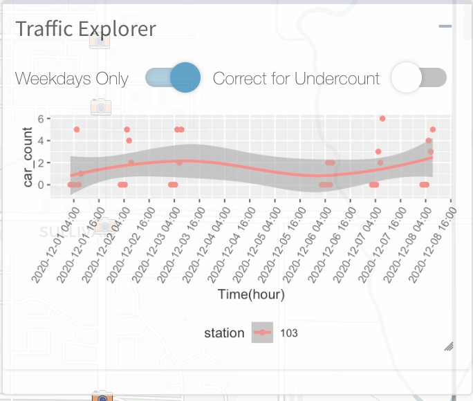
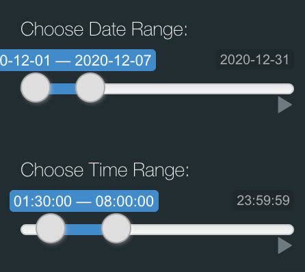
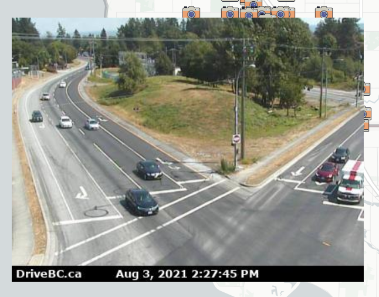
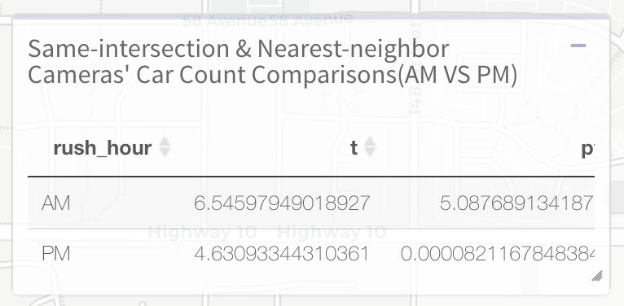
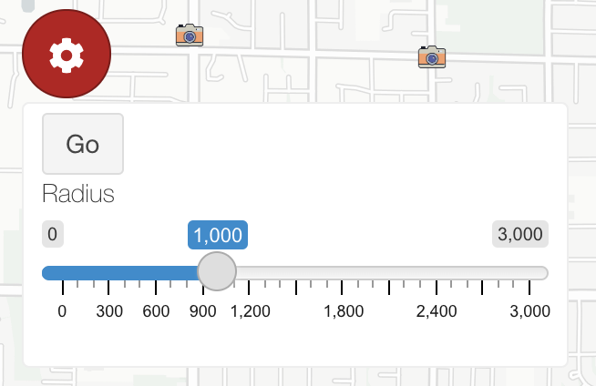
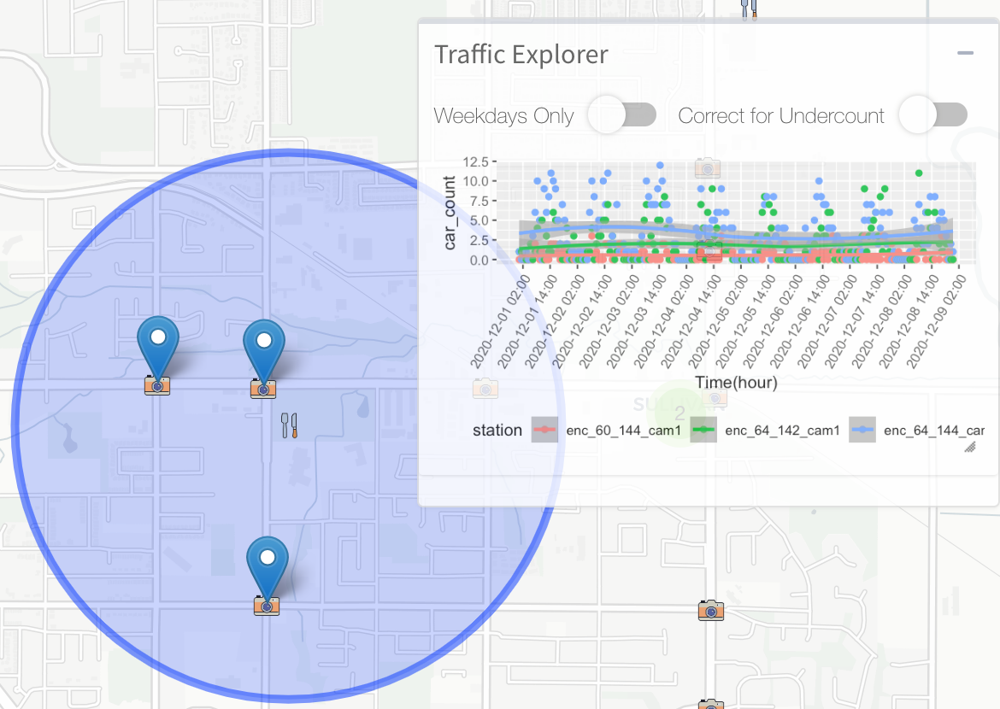
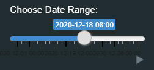

## Unbiased Mobility Project
**Hosted by:** The Data Science for Social Good (DSSG) program at the University of British Columbia

**Sponsor:** Cedar Academy Society - VanCom Project  

**App Development:** Ruiyu Gou, Nancy Wan, Martin So

Public sector and academic communities have been using mobility and traffic data as a proxy measurement for a variety of social topics, from GDP prediction and economic development to greenhouse gas emissions and environmental impact.

One method to measure mobility and acquire traffic data is through the analysis of pictures and footage from traffic cameras installed at fixed locations (in urban and rural areas). 

## Data Pipeline
Traffic camera snapshots are taken at each camera locations. Information of vehicle counts of different categories are extracted using computer vision method. 

Specifically, this pipeline uses the object detection system You Only Look Once, namely YOLO. It is one of the state-of-the-art detection model, known for being both accurate and fast. It detects different vehicles in the image with bounding boxes at the locations, then translate them into counts of objects of interest.

## UI Features 
In general the app uses the two maps for its basemap. The Positron and the Dark Matter basemaps found [here](https://carto.com/blog/getting-to-know-positron-and-dark-matter/). The Positron map is used in the Camera Map menu to assist users to street names and routes while the DarkMatter map is used to assist in heatmap visualization in order to predict the change traffic patterns over time.

### Cams Map

#### Traffic Explorer
The traffic explorer panel acts as the core **visualization** tool for the traffic states under different scenarios. It displays a scatter plot of `Vehicle Counts` VS `Time`, and users may choose to filter on specific vehicle type, camera stations and date-time ranges to examine any trend or pattern. There is also a play button attached to the time slider, allowing the user to view the animation of changes in vehicle counts over time.

#### Multi-camera Selection
The Cams Map is supporting **multi-camera selection** and **auto-focus** on the current selected camera. Users can select a new camera station either through the select input in the side menu or a marker click, and can deselect by clicking on the highlighted marker again. 

#### Undercounting Correction
Traffic camera images, especially at busy intersections, suffer from high occlusion between vehicles and low resolution due to the hardware constraint. Current pipeline often fails to detect the semantic features when they interweave, thus is missing count when there is a long line-up. On the other hand, it is actually able to detect the vehicles correctly at far distance when traffic is free-of-flow since the cars are more apart. This leads to two consequences:

- **saturation** of counts, the maximum vehicle count at the example intersection is capped at around 15 where one can easily find snapshot with 20+ cars under visual check. 

- **random noise**: the data shows fluctuations not due to the change in actual number of vehicles, but due to the failure of object detection, as the line-up resulting from red light almost always appear out-of-sync from the snapshot frequency. It introduces inconsistent biases when the images used for statistical inference are sampled with a lower frequency.

Our `Correct for Undercount` feature uses a model learned from manually labeled traffic images (including number fo vehicle count and Queue/Free-of-Flow category) to add correction for this detection bias. It is expected to generate more reliable traffic data for cameras.

Notice that the current used one is a preliminary version only effective to car counts. It is to be improved and generalized to other vehicle types in the future.

#### Real-time Camera Image

When the toggle is active, **livefeed image** of the **current selected camera** (if multiple cameras are selected, the newest clicked one is the current selected camera) is displayed at the bottom left corner on the map.   
The app fetches the image in realtime from the server endpoint provided by VanCom project. The frequency of livefeed update depends on the server.

#### Same-intersection and Nearest-neighbor Cameras' Comparison

Another key objective of the app is to conduct comparisons over a pair of **spatially correlated** cameras to see if they share similar traffic states(i.e. vehicles counts) concurrently. AM(7-10) and PM(16-19) rush hours are targeted due to intense traffic activities over the periods. 

The pair of **spatially correlated** cameras are identified as either:

- Two cameras installed on the **same intersection**
- Two cameras which are **spatial nearest neighbors**

**Note**: The nearest neighbor is not always symmetric, and the next-selected camera has to be the nearest neighbor to the prev-selected camera, i.e. if camera a's nearest neighbor is camera b, yet camera b's nearest neighbor is camera c, then you should select a then b to form a valid pair, but not the other way round.

Our `Same-intersection & Nearest-neighbor Cameras' Car Count Comparison(AM VS PM)` table feature keeps track of the current selected cameras and will perform and demonstrate the results of a **paired**(same-intersection)/**two-sample**(nearest-neighbor) t-test of the cameras' car count over AM and PM rush hours within a date range **only if** they meet the requirements for comparable cameras above. 

The date range is customizable through a slider input control in the left side menu, and the user is also able to toggle on **weekdays only** in the explorer panel, considering the fact that rush hour effects are more consistent during weekdays.

Overall, without considering the spatial effect, there has been found a **greater** difference during **PM** rush hours compared to AM based on the December 2020's hourly data. However, the results vary across different locations and may require further experiments with more data. 

Notice that **camera metadata**(i.e. facing direction, angle, elevation) is another key factor which may induce significant differences across cameras even when they are considered as a valid pair. Due to the lack of data, this could be potentially included as a future improvement.

#### Business Overlays

There are 6 business overlays included in this application. All of them are clustered into groups. Those are:    
-  Stores
-  Foods and Restaurants
-  Liquor Stores
-  Health and Medicine
-  Businesses and Finance
-  Services.  

Services are a vague term to incorporate businesses that are not categorized into the other 5 categories.  This does not include home based businesses.  As the map is zoomed in, the clusters become more dispersed and each individual business icon is shown more in detail. In order to view the name of the business, the cursor must be hovered ontop of the icon. 

#### Nearby Cameras of Businesses

As one may notice, there is another option in the business overlays' drop-down called `Nearby Cams`. This toggle control will allow the user to locate nearby cameras upon selecting on a business marker and to view the traffic counts captured by them in the explorer panel. This is aimed to give user a brief understanding of the nearby traffic states.

The **range** within which you wish to find nearby cameras can also be customized through the `red gear button` on the top left corner, and the radius is adjustable in **meters** through a slider input. Notice that the current maximum number of nearby cameras is set to default **3** (considering the basic usage), so the highlighted cameras will not exceed 3 however you adjust the radius. 

#### Bicyle Routes
An overlay of bicycle routes is included in this application along with the overlay panels. Proposed bicycle routes are not included in this overlay. To view the bicycle routes, ensure that the label "Bike Routes " is checked. The bicycle routes are coloured in 7 types. This is shown in the legend listed in the top left corner. It is important to note that the legend is partially hidden from the menu and is undraggable. In order to fully view the legend, the panel (with  the 3 bars) must be collapsed.

#### Neighbourhood Filters 
A selection of neighbourhoods is available for selection. The following neighbourhoods are:
-  City Centre for `CITY CENTRE` 
-  Cloverdale for `CLOVERDALE`
-  Fleetwood for `FLEETWOOD`
-  Newton for `NEWTON`
-  South Surrey for `SOUTH SURREY`
-  Whalley for `WHALLEY`

The option panel is on the left hand side and it is titled "Select a Neighbourhood". The default selected is `SURREY`, where it displays all the neighbourhoods within the city of Surrey. When a neighbourhood is selected, the map will shift its view to the selected neighbourhood.

### Heatmap

An option to switch to the heatmap view is provided on the sidebar on the left labelled `Heatmap`. As of now, the heatmap only displays car count.

Similar to the basemap in the `Camera Map`, the heatmap has boundaries of all the neighbourhoods of Surrey. However unlike the boundaries found in `Camera Map`, where the user can filter out individual neighbourhoods, the boundaries for `Heatmap`is only fixed to the entire city of Surrey. 

The intensity, which is found in the different colour hues of different points of the heatmap, is dependent on the volume of the car count in a camera locations. Car counts with higher traffic are highlighted in deep red while lower car counts will be in light peach. The interval levels are heuristically determined by the `addHeatmap()` function. Additionally, all the overlays except the 'Nearby Cams' feature are functional when the heatmap is toggled.  

The slider ranges from `2020-12-01 00:00 to 2020-12-31 23:59`. Each tick within the slider represents a one hour change in the traffic pattern.

Similar to the traffic explorer slider, the time slider for the heatmap also has a play button attached which allows the user to view an animated visualization of the change in traffic intensity over time.

An ongoing issue with the heatmap is that the user may experience flashes when the heatmap renders high traffic volumes, particularly in rush hour periods (from 6-10 AM to 3-7 PM. Currently, this is a bug that will be hopefully resolved in later versions of this app.

## Acknowledgement
